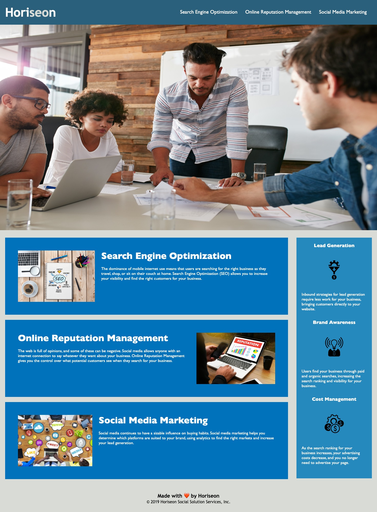

# VibrantSynergy

## Description

This website was made to demonstrate the students programming ability to implement semantic HTML elements, and accessible alt attributes. The "alt" attribute is used to provide alternative text for images, and the "semantic" tags are used to provide additional meaning to the structure of the content on a web page. The alt text is important for accessibility, as it is read by screen readers to describe the image to visually impaired users. The semantic tags, such as "header", "nav", "main", "article", "section", and "footer", provide additional information about the structure and organization of the content, which can improve accessibility and search engine optimization.

## Table of Contents

- [Usage](#usage)
- [Credits](#credits)
- [License](#license)
- [Badges](#badges)

## Installation

N/A

## Usage

Read through the services at Horiseon listed below:

1. Search Engine Optimization
2. Online Reputation Management
3. Social Media Marketing
4. Lead Generation
5. Brand Awareness
6. Cost Management

## Credits

[Image alt info](https://www.w3schools.com/tags/att_img_alt.asp)

[html5 semantic elements](https://www.w3schools.com/html/html5_semantic_elements.asp)

## License

MIT License

Copyright (c) 2023 Shayne Whayne

Permission is hereby granted, free of charge, to any person obtaining a copy
of this software and associated documentation files (the "Software"), to deal
in the Software without restriction, including without limitation the rights
to use, copy, modify, merge, publish, distribute, sublicense, and/or sell
copies of the Software, and to permit persons to whom the Software is
furnished to do so, subject to the following conditions:

The above copyright notice and this permission notice shall be included in all
copies or substantial portions of the Software.

THE SOFTWARE IS PROVIDED "AS IS", WITHOUT WARRANTY OF ANY KIND, EXPRESS OR
IMPLIED, INCLUDING BUT NOT LIMITED TO THE WARRANTIES OF MERCHANTABILITY,
FITNESS FOR A PARTICULAR PURPOSE AND NONINFRINGEMENT. IN NO EVENT SHALL THE
AUTHORS OR COPYRIGHT HOLDERS BE LIABLE FOR ANY CLAIM, DAMAGES OR OTHER
LIABILITY, WHETHER IN AN ACTION OF CONTRACT, TORT OR OTHERWISE, ARISING FROM,
OUT OF OR IN CONNECTION WITH THE SOFTWARE OR THE USE OR OTHER DEALINGS IN THE
SOFTWARE.

## Badges

  

## Features

N/A

## How to Contribute

N/A

## Tests

N/A